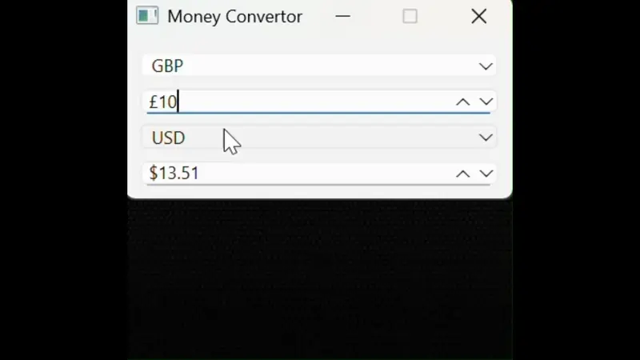

# Money-Conversion-Gui

A simple money conversion GUI that I didn't expect to publish, as it was only meant to be a personal project to learn how to use a GUI library - Made using PySide6.

**Note:** Please sign up at [https://www.exchangerate-api.com/](https://www.exchangerate-api.com/) and get an API key—otherwise, conversions will not work.

Check `config.py` to see a dictionary of currencies. Feel free to add more; they should work if the 3-character abbreviation is recognized by the API. You can also find where to place your API key in that file.

# Preview

